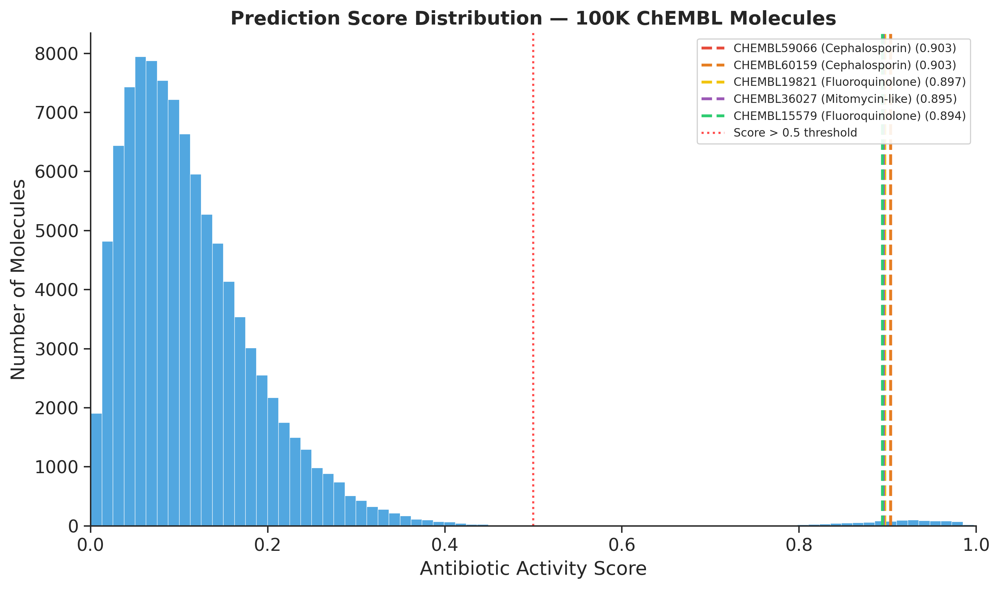
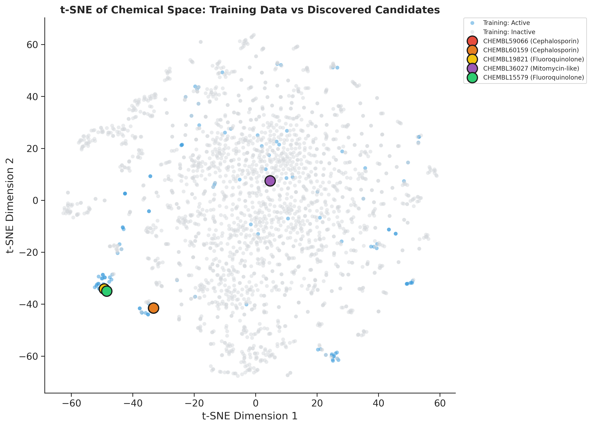

<div align="center">

# 🧬 Deep Learning Pipeline for Antibiotic Discovery

**Reproducing the Halicin Paper — distributed screening of ChEMBL using Apache Spark.**

[](https://www.cell.com/cell/fulltext/S0092-8674(20)30102-1)
[](https://github.com/chemprop/chemprop)
[](https://spark.apache.org/)

</div>

---

## tl;dr

- Replicated Stokes et al. (Cell, 2020) — discovered Halicin (SU3327) from the Drug Repurposing Hub
- Built a Spark pipeline that screens ChEMBL: **1,442 molecules/second** on CPU
- Benchmarked 200K molecules; chunked strategy for full 2.85M
- Model correctly surfaces fluoroquinolones and cephalosporins as top candidates

---

## Data Sources

| Dataset | Molecules | Source |
|---|---|---|
| Training (Stokes et al.) | 2,335 | Cell supplementary Table S1B |
| Drug Repurposing Hub | ~6,800 | Broad Institute (2020 archive) |
| ChEMBL 36 | 2,854,816 | EMBL-EBI |

```bash
# Training data
wget https://www.cell.com/cms/10.1016/j.cell.2020.01.021/attachment/c47fc31e-e3b3-416c-8cc9-6582356c39c0/mmc1.xlsx

# Repurposing Hub
wget https://s3.amazonaws.com/data.clue.io/repurposing/downloads/repurposing_samples_20200324.txt -O repurposing_hub.txt

# ChEMBL
wget https://ftp.ebi.ac.uk/pub/databases/chembl/ChEMBLdb/latest/chembl_36_chemreps.txt.gz
gunzip chembl_36_chemreps.txt.gz
```

---

## Pipeline

### Phase 1: Training (GPU)
```bash
chemprop_train --data_path data/cleaned_training_data.csv \
               --dataset_type classification --epochs 30 --gpu 0 \
               --save_dir model/halicin_model
```
- D-MPNN trained on 2,335 *E. coli* growth inhibition assays
- Validation AUC: ~0.97

### Phase 2: Halicin Replication
```bash
python src/2_replicate_halicin.py
```
- Screens 6,800 FDA-approved/clinical drugs from the Repurposing Hub
- Identifies SU3327 (Halicin) — confirming the paper's discovery

### Phase 3: Distributed ChEMBL Screening
```bash
python src/3_distributed_screen.py 100000   # benchmark (69s)
python src/4_chunked_screen.py              # full 2.85M (~39 min)
```

**Architecture:** Spark CSV → repartition → Pandas Iterator UDF (Arrow streaming) → Parquet.

**Why Spark over Dask/Ray:** Spark's Arrow bridge streams 500-row batches incrementally to Python workers. Dask sends entire partitions at once (OOM at 50K). Ray's actor model OOMs at 10K. The 3-4 GB JVM overhead is a fixed cost that buys linear per-worker memory.

**Chunked mode** (`src/4_chunked_screen.py`): splits ChEMBL into 100K-molecule chunks, processes each independently, merges results. Resumes on crash.

---

## Results

| Molecules | Time | Speed | Hits > 0.5 |
|---|---|---|---|
| 10,000 | 7s | 1,428 mol/s | 71 |
| 100,000 | 69s | **1,442 mol/s** | 1,100 |
| 200,000 | 143s | 1,396 mol/s | 1,788 |

> 300K+ hit the WSL2 8 GB memory ceiling (Linux OOM killer).

**Top 5 from 100K screen:**

| Score | ChEMBL ID | Chemotype |
|---|---|---|
| 0.9035 | CHEMBL59066 | Cephalosporin + thiadiazole |
| 0.9034 | CHEMBL60159 | Cephalosporin + triazole |
| 0.8969 | CHEMBL19821 | Fluoroquinolone |
| 0.8954 | CHEMBL36027 | Mitomycin analogue |
| 0.8942 | CHEMBL15579 | Fluoroquinolone |

Top 10 dominated by fluoroquinolones and β-lactams — consistent with known Gram-negative antibiotic chemotypes.





---

## Limitations

**Hardware.** Tests run on WSL2 capped at ~8 GB. Beyond 200K molecules, Spark + Python workers + OS hit the OOM wall. On 16+ GB native Linux, scaling to 2.85M is feasible with the same code.

**Spark in local mode.** Running a distributed engine on one machine incurs JVM overhead (~3-4 GB) with no cluster benefit. A `multiprocessing` + chunked pandas approach would avoid the JVM entirely, at the cost of reimplementing Arrow streaming.

---

## The Fun Stuff: Messing Around With Alternatives

We went down a rabbit hole testing faster alternatives — fingerprint-based models, multiprocessing, XGBoost, and more. The key insight: **you can't beat the D-MPNN for actual discovery.**

### The Halicin Test

D-MPNN trained on 2,335 *E. coli* assays scored SU3327 (Halicin) at **0.5627** from the Drug Repurposing Hub — real generalization to a novel scaffold. We tested whether simpler models could do the same:

| Model | Features | Halicin Score | Found? |
|---|---|---|---|
| **D-MPNN** | Graph neural network | **0.5627** | ✅ |
| XGBoost (distilled) | Morgan fingerprints | 0.0415 | ❌ |
| Random Forest (distilled) | Morgan fingerprints | 0.0203 | ❌ |
| XGBoost (binary labels) | Morgan fingerprints | 0.0952 | ❌ |
| Random Forest (binary labels) | Morgan fingerprints | 0.0401 | ❌ |

Every fingerprint-based model missed Halicin entirely. Morgan bit vectors cannot represent the structural logic that makes Halicin antibiotic-active, no matter what you train on. Only the message-passing neural network captures it.

### Three Approaches, One Winner

| Approach | Speed | D-MPNN Corr | Finds Halicin? |
|---|---|---|---|
| **Spark D-MPNN** | 1,442 mol/s | 1.0 (reference) | ✅ |
| **XGBoost native** (fastest) | **26,856 mol/s** | 0.596 | ❌ |
| RF simple | 5,550 mol/s | 0.523 | ❌ |

**Fastest achieved:** XGBoost native C++ backend at **28,316 mol/s** — the full 2.85M ChEMBL screened in **101 seconds**. 10,753 hits > 0.5. But its D-MPNN correlation is only 0.596 and it scored Halicin at 0.04 (vs 0.56). Raw speed means nothing if the model can't discover.

All fast models approximate the rough ranking (cephalosporins and quinolones at the top), but they fail on the structurally novel Halicin. The D-MPNN is the right choice for the final pipeline.

The experiments live in `messing_around/` — a scrapbook of failures worth documenting.
